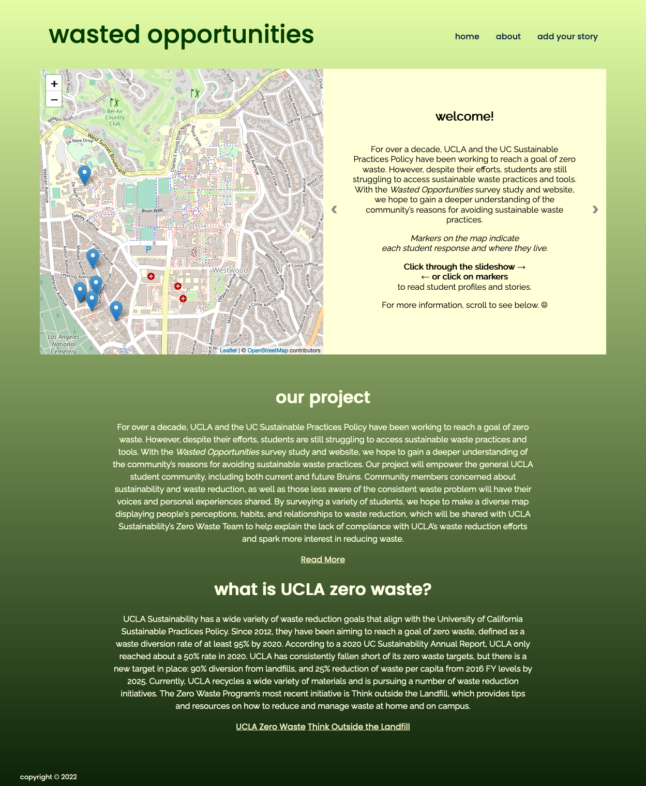
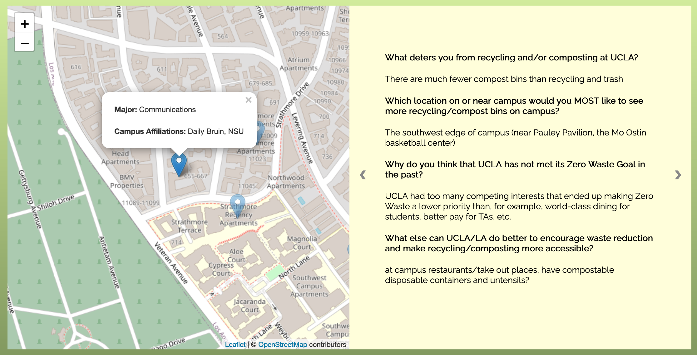
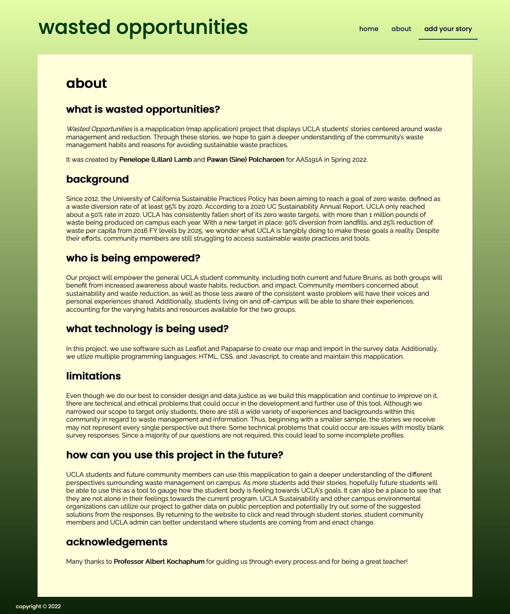

# Wasted Opportunities
### By Penelope (Lillan) Lamb + Pawan (Sine) Polcharoen
> Wasted Opportunities is a mapplication (map application) project that displays UCLA students’ stories centered around waste management and reduction. Through these stories, we hope to gain a deeper understanding of the community’s waste management habits and reasons for avoiding sustainable waste practices.
> 
> This website functions best on Firefox.
> Live demo [_here_](https://penelopelamb.github.io/wasted-opportunities/index.html).

## Table of Contents
* [Objective](#seedlingobjective)
* [Who is being empowered?](#seedlingwho-is-being-empowered)
* [What technology was used?](#seedlingwhat-technology-was-used)
* [How it can be repurposed?](#seedlinghow-it-can-be-repurposed)
* [The Mapplication](#seedlingthe-mapplication)

## :seedling:Objective
### What social problem is being addressed?
Since 2012, the University of California Sustainable Practices Policy has been aiming to reach a goal of zero waste, defined as a waste diversion rate of at least 95% by 2020. According to a 2020 UC Sustainability Annual Report, UCLA only reached about a 50% rate in 2020. With a new target in place: 90% diversion from landfills, and 25% reduction of waste per capita from 2016 FY levels by 2025, we wonder what UCLA is tangibly doing to make these goals a reality. Despite their efforts, community members are still struggling to access sustainable waste practices and tools. We hope to address this issue with our mapplication, Wasted Opportunities, and showcase student voices on waste reduction and management. Ultimately, we hope to assist UCLA Sustainability in understanding the community’s reasons for avoiding sustainable waste practices.

## :seedling:Who is being empowered?
Our project will empower the general UCLA student community, including both current and future Bruins, as both groups will benefit from increased awareness about waste habits, reduction, and impact. Community members concerned about sustainability and waste reduction, as well as those less aware of the consistent waste problem will have their voices and personal experiences shared. Additionally, students living on and off-campus will be able to share their experiences, accounting for the varying habits and resources available for the two groups.

## :seedling:What technology was used?
In this project, we will be using software such as Leaflet and Papaparse to create our map and import in our survey data. Moreover, we will be utilizing multiple programming languages: HTML, CSS, and Javascript, to create our mapplication.

To create the website and mapplication itself, we utilzed 2 main HTML files, 1 CSS file, and 2 Javascript files. Our HTML files were for our Home and About pages. We connected the CSS and Javascript files to these main HTML files to incorporate style elements and our interactice map and slideshow features.

### What technical and ethical problems could there be in developing this tool?
Although we narrowed our scope to target only students, there are still a wide variety of experiences and backgrounds within this community in regard to waste management and information. Thus, beginning with a smaller sample, the stories we receive may not represent every single perspective. Some technical problems that could occur are issues with mostly blank survey responses. Since a majority of our questions are not required, this could lead to incomplete profiles.

## :seedling:How it can be repurposed?
### Long-term Impact
We hope that this project will bring awareness to UCLA’s zero waste goals. Our map filled with waste ‘profiles’ of the community will provide anecdotes and insight as to why UCLA is missing its zero waste target. By surveying a variety of student community members, we hope to make a diverse map displaying people's perceptions, habits, and relationships to waste reduction, which could help explain the lack of compliance with UCLA’s waste reduction efforts and spark more interest in reducing waste. The mapplication could be distributed to UCLA’s Environmental Student Network and the sustainability team of the housing association, where it could be shared along with current waste reduction infographics on the hill. We can also provide our mapplication to UCLA Sustainability’s Zero Waste team so that they are better informed about student waste habits.

### How others can use this project in the future.
UCLA students and future community members can use this mapplication to gain a deeper understanding of the different perspectives surrounding waste management on campus. As more students add their stories, hopefully future students will be able to use this as a tool to gauge how the student body is feeling towards UCLA's goals. It can also be a place to see that they are not alone in their feelings towards the current program. UCLA Sustainability and other campus environmental organizations can utilize our project to gather data on public perception and potentially try out some of the suggested solutions from the responses. By returning to the website to click and read through student stories, as well as adding their own, student community members and UCLA admin can better understand where students are coming from and enact change.

## :seedling:The Mapplication
### Features
1. **Interactive Map**

The Leaflet Map is very interactive for the user. It is centered around UCLA's campus, and the markers are indicative of each student response and where they live. By clicking on a marker, the map will fly to that marker and it will be the only marker highlighted. Furthermore, clicking a marker creates a pop-up displaying the respondent's profile, including Major and Campus Affiliations. The slideshow to the right of the map also changes to that respondent's survey answers, creating a full story for this community member. 

2. **Slideshow**

The Slideshow is also interactive for the user and connects with our map. When you first enter the website, the slideshow displays a welcome message and some basic information about the project. There are also simply instructions on how to navigate the site's Home Page and see student stories. As you click through the slideshow, you will see each respondent's open response survey questions on a different page. Clicking through also results in the map flying to each student's marker and displaying their full profile and story.

3. **Menu Bar + Survey Button**

The menu bar at the top of the mapplication allows for easy navigation between the Home page and About page. It also holds our 'Add Your Story' button, which leads users to the survey we built for this project.

4. **Descriptions**

Underneath our map and slideshow, there are descriptions to the project and UCLA Zero Waste. Along with these descriptions, there are links to find out more about both topics.

5. **About Page**

The About page serves as a place where users can learn more details about the project without taking space away or distracting from the main map feature on the Home page.

### Screenshots
**Wasted Opportunities Home Page:**

**Wasted Opportunities Map Feature & Slideshow, Student Profile:**

**Wasted Opportunities About Page:**

## Acknowledgements
- This project was created as part of the AAS191A: Web Development and GIS for Social Change course at UCLA.
- Many thanks to Professor Albert Kochaphum for guiding us through every process and for being a great teacher!
